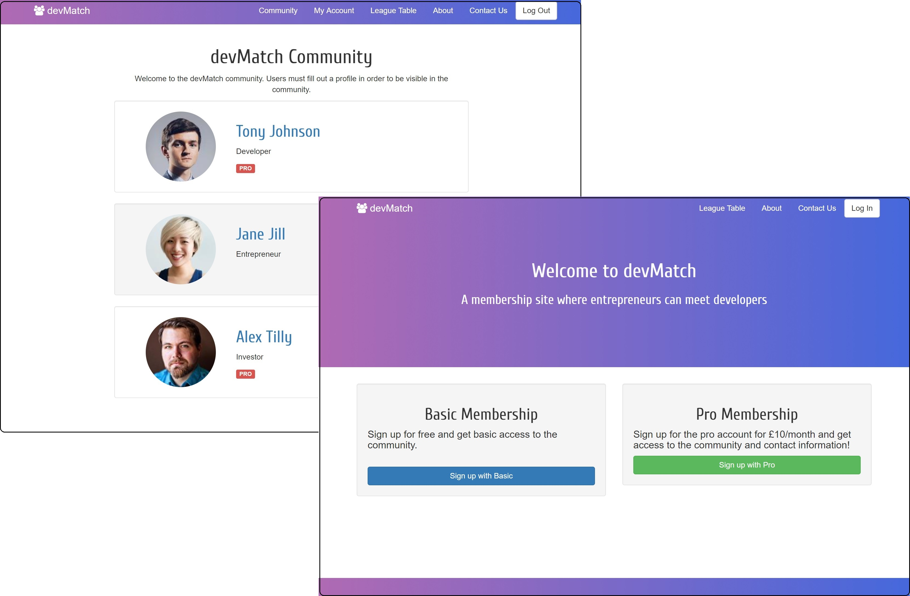

# devMatch

[devMatch](https://dev-match-ror.herokuapp.com/) - A community of entrepreneurs, investors and developers

Freemium business model with user authentication, image upload, payment handling and hosted on a production server.

### Built with:
* Ruby 2.3.0
* Rails 5
* HTML5
* CSS/SASS
* Javascript
* Bootstrap
* Cloud9 IDE (Linux)

### Features include:
* User authentication using Devise gem, with limited features for users on free plan. See saasapp/app/views/users/show.html.erb
* Image upload for profile pictures using Paperclip gem. See saasapp/app/models/profile.rb
* Handling credit card details for Stripe subscription payments using Javascript. See saasapp/app/assets/javascripts/users.js
* Use of ENV variables to store and hide public/private keys for Stripe API integration. See saasapp/config/initializers/stripe.rb
* Use of Heroku production servers for hosting managed in the terminal.

### Problems overcome:
* This was my first Ruby on Rails course.
* It helped build my foundational understanding of the MVC pattern.
* After completing, I took what I learnt to add my own feature, the league table. Here, I ranked users by their engagement and added a query to the controller to display the position and stats of the current user, even if they weren't in the top 5.

